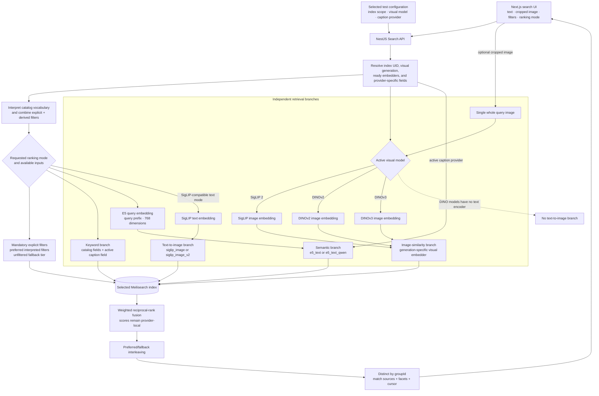

# Architecture

## Boundaries and data flow

The system reads SampleHub MySQL and S3 with read-only credentials. It owns only Meilisearch documents, Redis jobs, a local SQLite control/caption database, and evaluation fixtures. It never updates SampleHub rows, descriptions, or objects.

### Catalog indexing and embedding generation

```mermaid
flowchart LR
  subgraph source[Read-only SampleHub sources]
    mysql[(MySQL product metadata)]
    s3[(S3 product images)]
  end

  subgraph worker[BullMQ indexer]
    job["Index job<br/>full · incremental · preview · backfill"]
    eligible["Eligibility filter<br/>and document mapping"]
    select["Image selection<br/>thumbnail or all images"]
    normalize["Safety checks and normalization<br/>EXIF · aspect-preserving resize · JPEG"]
    views["Current catalog views<br/>whole image + adaptive long-axis crops"]
    representative["Representative image<br/>thumbnail or first-image fallback"]
  end

  mysql --> job --> eligible --> select
  s3 --> select
  select --> normalize
  normalize --> views
  normalize --> representative

  subgraph visual[Parallel visual embeddings]
    siglip["SigLIP 2 NaFlex<br/>native aspect · up to 576 patches"] --> sigvec["siglip_image_v2<br/>768 dimensions"]
    dino2["DINOv2 Base<br/>392 letterbox · CLS + patch mean"] --> dino2vec["dinov2_image_v2<br/>768 dimensions"]
    dino3["DINOv3 ViT-B/16<br/>384 letterbox · CLS + patch mean"] --> dino3vec["dinov3_image_v2<br/>768 dimensions"]
  end

  views --> siglip
  views --> dino2
  views --> dino3

  subgraph captions[Provider-specific caption and E5 branches]
    identity["Image hash + provider/model/prompt fingerprint"]
    cache[(SQLite caption cache)]
    cached{"Caption cache hit?"}
    provider{"Configured caption provider"}
    florence["Florence 2<br/>MORE_DETAILED_CAPTION"]
    qwen["Qwen 3.5 0.8B<br/>material prompt v2"]
    captionResult["Provider-specific caption"]
    captionOutput{"Caption provider"}
    florenceField[generatedVisualCaption]
    qwenField[generatedVisualCaptionQwen]
    florencePassage["Structured fields + Florence caption"] --> e5Florence["Multilingual E5 passage"] --> e5vec["e5_text<br/>768 dimensions"]
    qwenPassage["Structured fields + Qwen caption"] --> e5Qwen["Multilingual E5 passage"] --> e5qvec["e5_text_qwen<br/>768 dimensions"]
  end

  representative --> identity --> cached
  cache <--> cached
  cached -->|hit| captionResult
  cached -->|miss| provider
  provider -->|Florence| florence --> captionResult
  provider -->|Qwen| qwen --> captionResult
  florence --> cache
  qwen --> cache
  captionResult --> captionOutput
  captionOutput -->|Florence| florenceField
  captionOutput -->|Qwen| qwenField
  florenceField --> florencePassage
  qwenField --> qwenPassage
  eligible --> florencePassage
  eligible --> qwenPassage

  merge["Merge product fields, captions,<br/>vectors, and embedding state"]
  fallback["Per-product failure fallback<br/>missing visual vector or structured-only E5"]
  target["Meilisearch target<br/>run shadow · preview · stable"]
  control[("SQLite control data<br/>runs · failures · fingerprints<br/>readiness · watermarks")]

  sigvec --> merge
  dino2vec --> merge
  dino3vec --> merge
  e5vec --> merge
  e5qvec --> merge
  eligible --> merge
  normalize -. invalid image or visual inference failure .-> fallback
  provider -. caption failure .-> fallback
  fallback -. preserve searchable document .-> merge
  merge --> target
  job <--> control
  merge --> control
```



Legacy indexes use the unsuffixed visual-vector names. Full current-generation builds produce all three visual providers, while caption backfills update only the selected caption field and its matching E5 vector.

### Query-time embedding and retrieval



Inference providers are lazy-loaded behind one priority scheduler. Interactive query work has priority over indexing work at task boundaries. Model-specific device settings may select MPS or CPU. DINOv3 verifies and extracts its local gated archive only on first use.

## Catalog and generated data

Eligible products satisfy:

```sql
deleted_at IS NULL AND COALESCE(is_private, 0) = 0 AND type = 'plan_product'
```

One source product becomes one search document. `groupId` is the first 32 hex characters of SHA-256 over normalized `[series, brand]`. Results are distinct by group while facets remain product-level.

Florence and Qwen caption only the thumbnail-designated original image, falling back to the first ordered original. Provider-specific cache identity includes the image SHA-256, model files/revision, prompt/task, generation settings, and normalizer. Florence uses `generatedVisualCaption`/`e5_text`; Qwen uses `generatedVisualCaptionQwen`/`e5_text_qwen`. Both caption fields are searchable but excluded from displayed attributes and public product contracts.

The E5 passage contains labeled public fields followed by the generated visual description and remaining source details. The inference service applies the required `passage:` prefix; query requests receive `query:`. Inputs are truncated to 512 tokens, average-pooled, and normalized.

## Vectors and retrieval

Each v2 document stores:

- `e5_text`: one 768-dimensional multilingual product-passage vector
- `siglip_image_v2`: current 768-dimensional SigLIP 2 NaFlex Base vectors
- `dinov2_image_v2`: current 768-dimensional DINOv2 Base vectors
- `dinov3_image_v2`: current 768-dimensional DINOv3 ViT-B/16 vectors

Legacy indexes retain the unsuffixed `siglip_image`, `dinov2_image`, and `dinov3_image` names. API inference and Meilisearch routing derive the visual generation from the active index schema; model changes never mix generations or ensemble multiple visual providers.

For current catalog embeddings, every selected source image contributes its whole frame. Images longer than a 1.2 aspect ratio additionally contribute two to four evenly spaced square tiles along the long axis, with five total views at most. SigLIP NaFlex preserves aspect ratio with at most 576 patches. DINOv2 at 392 and DINOv3 at 384 receive ImageNet-mean-padded square letterboxes, then combine independently normalized CLS and patch-mean descriptors at 50/50. DINOv3 excludes its four register tokens from the patch mean. Query images use the same model preprocessing but only one whole-image vector.

No new `siglip_text` product vector is generated. SigLIP text encoding remains useful for searching the SigLIP visual vector space. Both DINO providers are image-only and cannot embed a text query into their vector spaces.

| Mode            | SigLIP active                                              | DINOv2 active                                         | DINOv3 active                                         |
| --------------- | ---------------------------------------------------------- | ----------------------------------------------------- | ----------------------------------------------------- |
| `keyword`       | raw lexical baseline                                       | raw lexical baseline                                  | raw lexical baseline                                  |
| `text_semantic` | E5 query against `e5_text`                                 | E5 query against `e5_text`                            | E5 query against `e5_text`                            |
| `text_hybrid`   | separate keyword and E5 branches                           | separate keyword and E5 branches                      | separate keyword and E5 branches                      |
| `text_visual`   | SigLIP text against its generation-specific image embedder | unavailable                                           | unavailable                                           |
| `image_visual`  | SigLIP image against its generation-specific embedder      | DINOv2 image against its generation-specific embedder | DINOv3 image against its generation-specific embedder |
| `auto`          | keyword + E5 + optional SigLIP text/image branches         | keyword + E5 + optional DINOv2 image branch           | keyword + E5 + optional DINOv3 image branch           |

Default auto weights are keyword/E5/SigLIP-text-to-image `0.40/0.40/0.20` for text-only SigLIP queries and keyword/E5/SigLIP-text-to-image/active-image `0.15/0.25/0.10/0.50` for combined SigLIP queries. Both DINO providers drop the incompatible text-to-image branch and retain the keyword, E5, and image weights. Values are relative reciprocal-rank weights, stored as ranking v2 settings in SQLite, and editable in `/admin`; raw scores from different models are never compared directly.

Auto mode caches the live color, material, effect, surface, and origin facet vocabulary and combines exact catalog phrases with curated English, Traditional Chinese, and Simplified Chinese synonyms. Attribute families can span fields: for example, stone intent becomes an OR across matching material and effect values, while independent concepts such as color and stone remain AND constraints. The first mentioned color is treated as the structured base color; secondary colors remain in the semantic/visual query unless the user explicitly joins colors with `and` or `or`.

Explicit filters override derived fields. Preferred candidates are fused separately and interleaved with unfiltered fallback candidates at approximately 85/15 (six preferred results per fallback), while explicit filters remain mandatory everywhere. Each result reports its actual contributing branches and primary match source. Specialist modes bypass catalog interpretation, keeping them useful as evaluation baselines. Facets without values are omitted by the web UI; relevance is the only supported sort while the source has no prices.

The API checks active index embedders on a short per-index cache. The selected scope resolves to stable, legacy preview, or current preview; its schema selects the matching inference generation and embedder names. The global visual-model and index-scope settings are persisted in SQLite. Search cursors include index UID, generation, and visual provider so pagination cannot silently cross any switch.

## Index lifecycle

A full build writes current-generation vectors to a run-specific shadow index and generates all three visual providers. Each unique source image is downloaded and normalized at most once per product batch before being shared by SigLIP, DINOv2, DINOv3, and the configured caption provider. The bounded libvips stage auto-orients and downsizes oversized sources while preserving aspect ratio; normal inputs pass through unchanged and the inference service retains its independent 25-million-pixel ceiling. Each document also stores `_visualEmbeddingState` with generation, per-model fingerprint, and vector count so matching backfills can resume without treating a changed normalization/crop/pooling profile as complete. Caption cache hits are reused; missing captions are generated in small batches. Input-specific HTTP 422 responses recursively split image and caption batches so one invalid asset cannot discard valid neighbors. A caption or caption-model failure is recorded but the product continues with structured E5 text.

Only a complete, count-matched, product-coverage-gated, smoke-tested shadow index swaps into the stable name. Coverage is measured per visual provider as products with at least one successful vector divided by products with at least one selected image; no-image products are excluded and remain searchable through structured text/E5. Stable builds require 95%. Preview builds require 90% and record an Admin warning below the 95% production target. Watermarks use the full-build start time so source changes during a long rebuild are captured by the next incremental. Incremental indexing detects stable generation, rehydrates changed products with the matching preprocessing/embedder names, maintains each registered provider, invalidates captions by content hash/model/task, deletes newly ineligible products, and advances watermarks after success.

Limited full runs deterministically hash source IDs with a fixed seed, so legacy/current previews select an identical sample. Each generation has a persistent preview name but is replaced only through a successful run-specific shadow swap. Preview runs never advance watermarks or swap stable. The API can route all search, facets, product/group reads, and evaluation to an explicitly selected completed preview.

The explicit `visual_backfill` and `dinov3_backfill` runs independently refresh DINOv2 or DINOv3 on a current-generation stable index without replacing it. Because Meilisearch validates all documents when a `userProvided` embedder is added, initialization first merges a null opt-out for the target embedder into every vector map, then registers it. Each update retrieves and verifies E5/SigLIP, preserves every other provider, and merges only the target DINO vector and its state. Same-fingerprint retries skip valid completed vector sets. Readiness is recorded independently only after every product is visited and product coverage reaches 95%. Legacy stable indexes reject these backfills.

The explicit `caption_backfill` run updates the selected stable or preview index in place. It walks indexed documents, resolves representative images through the provider-specific cache, regenerates the matching E5 passage, and merges only that provider's caption/vector into the complete vector map. Per-product failures preserve an existing successful provider value or create structured-only E5 when none exists; structural, provider-service, E5, and Meilisearch failures stop the run. Readiness is recorded per provider and index UID only after complete vector coverage and a semantic smoke query.

## Local control data

SQLite stores migrations, index runs and failures, caption cache entries, stream watermarks, ranking v2 settings, active visual-model/readiness settings, evaluation queries, judgments, and reports. Legacy ranking JSON is left intact under its original key. Evaluation images live under `data/evaluation`; shopper uploads remain in memory and are discarded after each request.
